# Building Your First RAG Chatbot

This hands-on tutorial teaches you how to build a complete Retrieval Augmented Generation (RAG) chatbot from scratch. You'll learn how RAG prevents AI hallucinations by grounding responses in real documents, and you'll create a working system that can answer questions about LlamaIndex documentation.

**What you'll learn:**

- What RAG is and why it's better than vanilla chatbots
- How to split documents into searchable chunks
- How vector embeddings enable semantic search
- How to combine retrieval with language models
- How to structure multi-flow QType applications

**What you'll build:**

A two-flow RAG system that:

1. **Ingests** 1,235 LlamaIndex Q&A pairs into a vector database
2. **Retrieves** relevant context when users ask questions
3. **Generates** accurate answers grounded in real documentation

**Time to complete:** 30-45 minutes

## Prerequisites

Before starting, you should have:

- **QType installed** with interpreter support: `pip install qtype[interpreter]`
- **Basic YAML familiarity** from the [chatbot tutorial](../Getting%20Started/01-chatbot-example.md)
- **AWS account** with Bedrock access (for embeddings and LLM)
- **Docker installed** (for running Qdrant locally)

Don't worry if you're new to RAG - we'll explain everything as we go!

---

## Understanding RAG: The Big Picture

Before we start coding, let's understand *why* RAG exists.

### The Problem with Basic Chatbots

When you ask a regular chatbot a question, it generates answers from its training data. This has two big problems:

1. **Outdated information** - Training data has a cutoff date
2. **Hallucinations** - The model might confidently make up facts

### How RAG Solves This

**RAG (Retrieval Augmented Generation)** adds a search step before generation:

```
User Question → Search Documents → Find Relevant Context → Generate Answer
```

Instead of answering from memory alone, the AI:

1. **Retrieves** relevant passages from your documents
2. **Augments** its prompt with that context
3. **Generates** an answer based on real information

This grounds responses in facts and eliminates hallucinations.

### The Two Flows We'll Build

Our RAG system has two distinct jobs:

```mermaid
flowchart LR
    subgraph Ingestion["📥 Ingestion Flow (Run Once)"]
        A[Load Docs] --> B[Split into Chunks]
        B --> C[Generate Embeddings]
        C --> D[Store in Database]
    end
    
    subgraph Chat["💬 Chat Flow (Run Many Times)"]
        E[User Question] --> F[Search Database]
        F --> G[Retrieve Context]
        G --> H[Generate Answer]
    end
    
    D -.->|"Indexed Documents"| F
```



1. **Ingestion Flow** (one-time setup)
   - Loads your documents
   - Splits them into chunks
   - Converts chunks to vectors (embeddings)
   - Stores vectors in a searchable database

2. **Chat Flow** (interactive)
   - Takes user questions
   - Searches for relevant chunks
   - Sends chunks + question to the LLM
   - Returns contextual answers

**Key insight:** The ingestion flow is like creating an index in a book - you do it once so you can quickly look things up later.

---

## Step 1: Set Up Your Environment

### 1.1 Start the Vector Database

RAG needs a place to store document embeddings. We'll use **Qdrant** because it's fast, open-source, and runs locally.

Start Qdrant with Docker:

```bash
docker pull qdrant/qdrant
docker run -p 6333:6333 -p 6334:6334 \
    -v "$(pwd)/qdrant_storage:/qdrant/storage:z" \
    qdrant/qdrant
```

**What this does:**

- `-p 6333:6333` - Exposes REST API at [localhost:6333](http://localhost:6333/)
- `-p 6334:6334` - Exposes GRPC API
- `-v` - Persists data to your local filesystem

Verify it's running by visiting [localhost:6333/dashboard](http://localhost:6333/dashboard)

### 1.2 Create the Vector Collection

Qdrant stores vectors in **collections**. Create one for our documents:

```bash
curl -X PUT 'http://localhost:6333/collections/documents' \
  -H 'Content-Type: application/json' \
  --data-raw '{
    "vectors": {
      "size": 1024,
      "distance": "Cosine"
    }
  }'
```

**Why these settings?**

- `size: 1024` - AWS Titan Embed produces 1024-dimensional vectors
- `distance: "Cosine"` - Measures semantic similarity between vectors

**Think of it like this:** Each document chunk becomes a point in 1024-dimensional space. Semantically similar chunks are close together, so searching means finding nearby points.

### 1.3 Configure AWS Credentials

We'll use AWS Bedrock for embeddings and LLM inference. Configure your credentials:

```bash
aws configure
# OR for SSO:
aws sso login --profile your-profile
export AWS_PROFILE=your-profile
```

**Verify access:**

```bash
aws bedrock list-foundation-models --query 'modelSummaries[?contains(modelId, `titan-embed`)]'
```

You should see Titan embedding models listed.

---

## Step 2: Create Your QType Configuration

Create a file called `my_rag_chatbot.qtype.yaml`:

```yaml
id: my_rag_chatbot
description: My first RAG chatbot that answers questions about LlamaIndex
```

Now let's build it piece by piece.

### 2.1 Configure AWS Authentication

First, tell QType how to access AWS:

```yaml
auths:
  - type: aws
    id: aws_auth
    profile_name: ${AWS_PROFILE}
```

**What's happening:**

- `type: aws` - Uses AWS SDK authentication
- `profile_name: ${AWS_PROFILE}` - Reads from environment variable
- `id: aws_auth` - We'll reference this ID in our models

### 2.2 Define the Embedding Model

Embeddings convert text into vectors. Add this model definition:

```yaml
models:
  - type: EmbeddingModel
    id: titan_embed_v2
    provider: aws-bedrock
    model_id: amazon.titan-embed-text-v2:0
    dimensions: 1024
    auth: aws_auth
```

**Understanding embeddings:**

- Embeddings capture *meaning* as numbers
- Similar text produces similar vectors
- `dimensions: 1024` means each chunk becomes 1,024 numbers
- Must match the collection size in Qdrant

**Why Titan Embed v2?**

- Fast and cost-effective
- Good quality for English text
- 1024 dimensions balance size and accuracy

### 2.3 Define the Language Model

This model generates natural language responses:

```yaml
  - type: Model
    id: claude_sonnet
    provider: aws-bedrock
    model_id: amazon.nova-lite-v1:0
    inference_params:
      temperature: 0.7
      max_tokens: 2048
    auth: aws_auth
```

**Parameter choices:**

- `temperature: 0.7` - Balanced creativity (0=deterministic, 1=random)
- `max_tokens: 2048` - Long enough for detailed answers

---

## Step 3: Configure the Vector Index

The index connects your QType flows to the Qdrant database:

```yaml
indexes:
  - type: VectorIndex
    module: llama_index.vector_stores.qdrant.QdrantVectorStore
    id: rag_index
    name: documents
    embedding_model: titan_embed_v2
    args:
      collection_name: documents
      url: http://localhost:6333
      api_key: ""
```

**Field breakdown:**

- `module` - LlamaIndex integration with Qdrant
- `embedding_model: titan_embed_v2` - Links to our embedding model
- `collection_name: documents` - Must match what we created in Step 1.2
- `api_key: ""` - Empty for local Qdrant (library requires this field)

**Why LlamaIndex?** QType uses LlamaIndex under the hood for vector store operations. This keeps the implementation clean and well-maintained.

---

## Step 4: Build the Ingestion Flow

Now for the exciting part! Let's build the flow that loads and indexes documents.

### 4.1 Define Flow Variables

Every flow needs to declare its data types:

```yaml
flows:
  - type: Flow
    id: document_ingestion
    description: Load, chunk, embed, and index documents from HuggingFace
    
    variables:
      - id: raw_document
        type: RAGDocument
      - id: document_chunk
        type: RAGChunk
      - id: embedded_chunk
        type: RAGChunk
    
    outputs:
      - embedded_chunk
```

**Understanding the types:**

- [`RAGDocument`](../components/RAGDocument.md) - A complete document with metadata
- [`RAGChunk`](../components/RAGChunk.md) - A piece of a document with optional embedding
- We output `embedded_chunk` so we can verify the process worked

### 4.2 Load Documents from HuggingFace

Add the first step:

```yaml
    steps:
      - id: load_documents
        type: DocumentSource
        reader_module: llama_index.readers.huggingface_fs.HuggingFaceFSReader
        loader_args:
          path: "datasets/AlignmentLab-AI/llama-index/modified_dataset.jsonl"
        outputs:
          - raw_document
```

**What this does:**

- `DocumentSource` - Loads documents from external sources
- `reader_module` - Uses HuggingFace's dataset reader
- `path` - Points to 1,235 LlamaIndex Q&A pairs
- `outputs: [raw_document]` - Each document flows to the next step

**Why HuggingFace?** No local file downloads needed! The reader streams directly from HuggingFace's API.


### 4.3 Split Documents into Chunks

Large documents must be split into searchable pieces:

```yaml
      - id: split_documents
        type: DocumentSplitter
        splitter_name: "SentenceSplitter"
        chunk_size: 512
        chunk_overlap: 50
        inputs:
          - raw_document
        outputs:
          - document_chunk
```

**Why chunk documents?**

1. **Context window limits** - LLMs can't process entire books
2. **Retrieval precision** - Smaller chunks = more relevant results
3. **Embedding quality** - Embeddings work best on focused text

**Parameter tuning:**

- `chunk_size: 512` - About 2-3 paragraphs of text
- `chunk_overlap: 50` - Preserves context across boundaries
- `SentenceSplitter` - Splits on sentence boundaries (cleaner than character-based)

**Example:** A 2,000-token document becomes ~4 chunks with some overlap to maintain meaning.

### 4.4 Generate Embeddings

Convert text chunks to vectors:

```yaml
      - id: embed_chunks
        type: DocumentEmbedder
        model: titan_embed_v2
        concurrency_config:
          num_workers: 5
        inputs:
          - document_chunk
        outputs:
          - embedded_chunk
```

**Performance optimization:**

- `num_workers: 5` - Processes 5 chunks in parallel
- For 1,235 documents → ~5,000 chunks
- Serial: ~10 minutes, Parallel: ~2 minutes

**What's in an embedding?** Each chunk becomes a list of 1,024 floating-point numbers that capture its semantic meaning.

### 4.5 Index in Qdrant

Finally, store the embeddings:

```yaml
      - id: index_chunks
        type: IndexUpsert
        index: rag_index
        batch_config:
          batch_size: 25
        inputs:
          - embedded_chunk
        outputs:
          - embedded_chunk
```

**Batching explained:**

- `batch_size: 25` - Uploads 25 chunks per request
- Balances speed and memory usage
- Too small = slow, too large = memory errors

**Complete ingestion flow diagram:**


---

## Step 5: Run the Ingestion Flow

Time to load your documents! Run:

```bash
uv run python -m qtype.cli run my_rag_chatbot.qtype.yaml --flow document_ingestion
```

**What you'll see:**

```
INFO: Loaded 1235 documents
INFO: Processing document 1/1235...
INFO: Successfully upserted 25 items to vector index in batch
INFO: Successfully upserted 25 items to vector index in batch
...
INFO: Ingestion complete! Indexed 5,127 chunks
```

**This takes 2-5 minutes.** Perfect time for a coffee break! ☕

**Verify in Qdrant Dashboard:**

Visit [localhost:6333/dashboard](http://localhost:6333/dashboard) and check:

- Collection `documents` exists
- Point count matches your chunks (~5,000)
- Dimensions = 1024

**Troubleshooting:**

- **AWS credentials error?** Run `aws sso login` again
- **Connection refused?** Verify Qdrant is running: `docker ps`
- **Out of memory?** Reduce `num_workers` to 3

---

## Step 6: Build the Chat Flow

Now let's build the interactive chat interface!

### 6.1 Define Chat Variables

```yaml
  - type: Flow
    id: rag_chat
    description: Answer questions using retrieved document context
    
    interface:
      type: Conversational
    
    variables:
      - id: user_message
        type: ChatMessage
      - id: user_question
        type: text
      - id: search_results
        type: list[RAGSearchResult]
      - id: context_prompt
        type: text
      - id: assistant_response
        type: ChatMessage
    
    inputs:
      - user_message
    outputs:
      - assistant_response
```

**Key differences from ingestion flow:**

- `interface: Conversational` - Enables chat UI
- `ChatMessage` types - Support multi-turn conversations
- `list[RAGSearchResult]` - Holds retrieved chunks

### 6.2 Extract the User's Question

Chat messages can contain multiple content blocks. Extract just the text:

```yaml
    steps:
      - id: extract_question
        type: FieldExtractor
        json_path: "$.blocks[?(@.type == 'text')].content"
        inputs:
          - user_message
        outputs:
          - user_question
```

**Why extract?** [`ChatMessage`](../components/ChatMessage.md) supports text, images, audio, etc. We need plain text for search.

**JSONPath explanation:**

- `$.blocks` - Array of content blocks
- `[?(@.type == 'text')]` - Filter to text blocks only
- `.content` - Extract the actual text

### 6.3 Search for Relevant Context

This is where RAG magic happens:

```yaml
      - id: search_index
        type: VectorSearch
        index: rag_index
        default_top_k: 5
        inputs:
          - user_question
        outputs:
          - search_results
```

**What VectorSearch does:**

1. Embeds the question using `titan_embed_v2`
2. Finds the 5 most similar chunks in Qdrant
3. Returns chunks with similarity scores

**Why top_k=5?**

- Too few (1-2): Miss relevant context
- Too many (>10): Noise overwhelms the LLM
- 5 is a sweet spot for most use cases

**Example:** 
- Question: "How do I create a vector index?"
- Retrieves: 5 chunks about VectorStoreIndex, SimpleVectorStore, etc.

### 6.4 Build the Context Prompt

Combine retrieved chunks with the user's question:

```yaml
      - id: build_prompt
        type: PromptTemplate
        template: |
          You are a helpful assistant that answers questions based on the provided context.
          
          Context from documents:
          {search_results}
          
          User question: {user_question}
          
          Please provide a detailed answer based on the context above. If the context doesn't contain relevant information, say so.
        inputs:
          - search_results
          - user_question
        outputs:
          - context_prompt
```

**Prompt engineering tips:**

- **Clear separation** - "Context:" and "Question:" sections prevent confusion
- **Acknowledgment clause** - "If context doesn't contain..." prevents hallucination
- **Instruction tone** - Sets expectations for grounded responses

**The template fills like this:**

```
Context from documents:
[Chunk 1 about vector indexes...]
[Chunk 2 about creating indexes...]
...

User question: How do I create a vector index?
```

### 6.5 Generate the Final Response

Send everything to the LLM:

```yaml
      - id: generate_response
        type: LLMInference
        model: claude_sonnet
        system_message: "You are a helpful assistant that answers questions based on provided document context. Be concise and accurate."
        inputs:
          - context_prompt
        outputs:
          - assistant_response
```

**Complete RAG chat flow diagram:**


---

## Step 7: Start the Chat Interface

Start the server:

```bash
qtype serve my_rag_chatbot.qtype.yaml --flow rag_chat
```

**Visit:** [localhost:8000/ui](http://localhost:8000/ui)


### Try These Questions

Ask questions about LlamaIndex to see RAG in action:

1. **Basic:**
   - "How do I create a vector index in LlamaIndex?"
   - "What is the difference between a query engine and a chat engine?"

2. **Technical:**
   - "How do I configure custom embeddings?"
   - "What callback handlers are available?"

3. **Edge cases:**
   - "Who won the 2024 Olympics?" (Should say "not in context")
   - "Tell me about pandas dataframes" (Should decline or acknowledge lack of context)

**Notice the difference:**

| Without RAG | With RAG |
|-------------|----------|
| "I think you can use VectorStore..." (guessing) | "Based on the documentation, use `VectorStoreIndex.from_documents()`..." (citing) |
| Generic advice | Specific code examples |
| Possible hallucinations | Grounded in real docs |

---

## Understanding What You Built

Let's reflect on the complete system:

### The Full Architecture


### Key Concepts You Learned

1. **Embeddings** - Converting text to semantic vectors
2. **Vector search** - Finding similar meanings, not just keywords
3. **Chunking strategies** - Balancing context and precision
4. **Prompt engineering** - Grounding LLM responses in facts
5. **Multi-flow applications** - Separating ingestion from interaction

### Why This Architecture?

- **Separation of concerns** - Ingestion runs once, chat runs many times
- **Scalability** - Add millions of documents without slowing chat
- **Accuracy** - Retrieval prevents hallucinations
- **Transparency** - Can show users which chunks informed the answer

---

## Experiment and Extend

Now that you have a working RAG chatbot, try:

### 1. Use Your Own Documents

Replace the HuggingFace source:

```yaml
- id: load_documents
  type: DocumentSource
  reader_module: llama_index.readers.file.FlatReader
  loader_args:
    input_dir: "./my_documents"
    recursive: true
  outputs:
    - raw_document
```

### 2. Tune Retrieval Parameters

```yaml
- id: search_index
  type: VectorSearch
  index: rag_index
  default_top_k: 10  # Try 3, 5, 10
  inputs:
    - user_question
```

**Experiment:**
- Fewer chunks = faster but might miss context
- More chunks = comprehensive but noisier

### 3. Add Document Conversion

Process PDFs, DOCX, etc.:

```yaml
- id: convert_documents
  type: DocToTextConverter
  inputs:
    - raw_document
  outputs:
    - text_document
```

See [`DocToTextConverter`](../components/DocToTextConverter.md) for details.

### 4. Improve Chunking Strategy

Try semantic chunking:

```yaml
- id: split_documents
  type: DocumentSplitter
  splitter_name: "SemanticSplitter"
  buffer_size: 1
  inputs:
    - raw_document
```

**When to use:**
- `SentenceSplitter` - General purpose, fast
- `SemanticSplitter` - Better context preservation, slower
- `TokenTextSplitter` - Precise token control

### 5. Add Citations

Show users where answers came from:

```yaml
- id: extract_sources
  type: FieldExtractor
  json_path: "$.chunk.metadata.file_name"
  inputs:
    - search_results
  outputs:
    - source_files
```

Then modify your prompt template to include `{source_files}`.

---

## Troubleshooting Common Issues

### Ingestion Fails

**Problem:** "Connection refused" error

**Solution:**
```bash
# Verify Qdrant is running
docker ps | grep qdrant

# Restart if needed
docker restart <container-id>
```

**Problem:** AWS authentication errors

**Solution:**
```bash
# Re-authenticate
aws sso login --profile your-profile

# Verify
aws bedrock list-foundation-models --region us-east-1
```

### Poor Search Results

**Problem:** Chat returns irrelevant answers

**Diagnosis:**
1. Check chunk sizes: `chunk_size: 512` might be too large/small
2. Verify embeddings: Different embedding models aren't compatible
3. Test search directly in Qdrant dashboard

**Solution:**
```yaml
# Try smaller chunks
chunk_size: 256
chunk_overlap: 25

# Or different splitter
splitter_name: "SemanticSplitter"
```

### Slow Performance

**Problem:** Ingestion takes >10 minutes

**Solution:**
```yaml
# Increase concurrency
concurrency_config:
  num_workers: 10  # Was 5

# Or batch more aggressively
batch_config:
  batch_size: 50  # Was 25
```

**Trade-off:** More workers = faster but higher memory usage

---

## Next Steps

Congratulations! You've built a production-ready RAG chatbot. 🎉

### Learn More About RAG

- [LlamaIndex RAG Guide](https://docs.llamaindex.ai/en/stable/getting_started/concepts/)
- [Qdrant Documentation](https://qdrant.tech/documentation/)
- [AWS Bedrock Models](https://docs.aws.amazon.com/bedrock/latest/userguide/models-supported.html)

### Explore QType Features

- **[Agent Tutorial](02-simple-agent.md)** - Add tool-calling to your chatbot
- **[Memory Concepts](../Concepts/memory.md)** - Maintain conversation history
- **[Custom Types Guide](../Getting%20Started/How%20To/03-custom-types.md)** - Define domain-specific data

### Production Considerations

Before deploying to production:

1. **Authentication** - Add API key auth to your endpoints
2. **Rate limiting** - Prevent abuse with quotas
3. **Monitoring** - Add OpenTelemetry for observability
4. **Error handling** - Handle edge cases gracefully
5. **Cost management** - Track AWS Bedrock usage

### Community and Support

- [GitHub Issues](https://github.com/bazaarvoice/qtype/issues) - Report bugs
- [Discussions](https://github.com/bazaarvoice/qtype/discussions) - Ask questions
- [Contributing Guide](../Development/contributing.md) - Improve QType

---

Happy building! If you found this tutorial helpful, give the [QType repo](https://github.com/bazaarvoice/qtype) a ⭐ on GitHub.