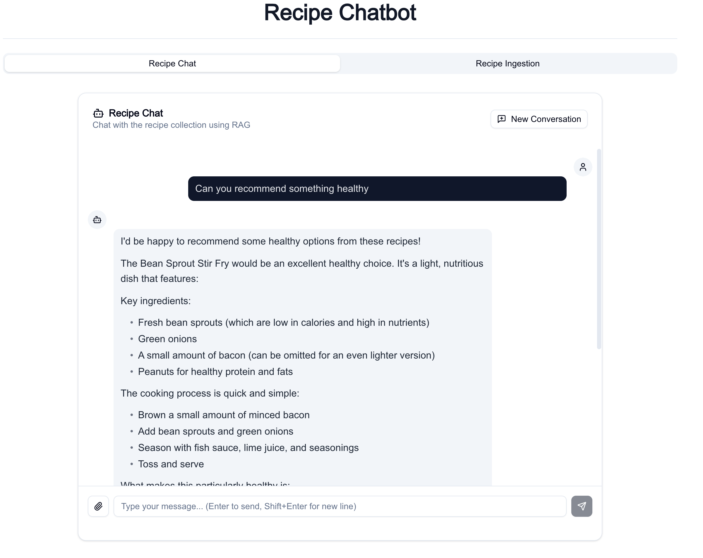

# Retrieval Augmented Generation Chatbot

## Overview

A complete RAG (Retrieval Augmented Generation) chatbot that answers cooking questions using a recipe collection from GitHub. The system ingests markdown recipe files, splits them into chunks, generates embeddings, stores them in a vector database, and provides conversational search with context-aware responses using memory to maintain conversation history.

## Architecture

```mermaid
--8<-- "Gallery/recipe_chatbot.mermaid"
```

## Complete Code

```yaml
--8<-- "../examples/rag/recipe_chatbot.qtype.yaml"
```

## Running the Example

### Prerequisites

Start Qdrant vector database locally:
```bash
docker run -p 6333:6333 qdrant/qdrant
```

Clone the recipe repository:
```bash
git clone https://github.com/clarklab/chowdown.git
```

### Ingest Recipe Documents

Run the ingestion flow to populate the vector index:
```bash
AWS_PROFILE=my_profile qtype run examples/rag/recipe_chatbot.qtype.yaml --flow recipe_ingestion --progress
```

This will:
1. Load all markdown files from `chowdown/_recipes/`
2. Split them into 512-token chunks with 50-token overlap
3. Generate embeddings using AWS Bedrock Titan
4. Store vectors in Qdrant collection `chowdown_recipes`

You should see the output similar to:
```
2026-02-04 06:38:06,222 - qtype.commands.run - INFO - Running flow from recipe_chatbot.qtype.yaml
2026-02-04 06:38:06,315 - qtype.commands.run - INFO - Executing flow recipe_ingestion from recipe_chatbot.qtype.yaml
/Users/lou.kratz/repos/qtype-cicd-fix/.venv/lib/python3.13/site-packages/llama_index/vector_stores/qdrant/base.py:238: UserWarning: Api key is used with an insecure connection.
  self._client = qdrant_client.QdrantClient(
/Users/lou.kratz/repos/qtype-cicd-fix/.venv/lib/python3.13/site-packages/llama_index/vector_stores/qdrant/base.py:241: UserWarning: Api key is used with an insecure connection.
  self._aclient = qdrant_client.AsyncQdrantClient(
╭─────────────────────────────────────────────── Flow Progress ────────────────────────────────────────────────╮
│                                                                                                              │
│  Step load_recipes   12.9 msg/s ▁▁▂▄▄▅▅▅▅▄▆▆▆▇▇█▇▇… ✔ 34 succeeded ✖ 0 errors ⟳ - hits ✗ - misses 0:00:02    │
│  Step split_recipes  14.9 msg/s ▁▁▁▃▂▅▅▅▆▅▆▆▇▇▇█▇▇… ✔ 39 succeeded ✖ 0 errors ⟳ - hits ✗ - misses 0:00:02    │
│  Step embed_chunks   18.7 msg/s ██▃▃▁▂▂▁▂▁▁▁▁▁▁▁▁▁… ✔ 39 succeeded ✖ 0 errors ⟳ - hits ✗ - misses 0:00:02    │
│  Step index_recipes  47.0 msg/s ████████▁           ✔ 39 succeeded ✖ 0 errors ⟳ - hits ✗ - misses 0:00:00    │
│                                                                                                              │
╰──────────────────────────────────────────────────────────────────────────────────────────────────────────────╯
2026-02-04 06:38:11,141 - qtype.commands.run - INFO - ✅ Flow execution completed successfully
2026-02-04 06:38:11,141 - qtype.commands.run - INFO - Processed 39 rows
2026-02-04 06:38:11,141 - qtype.commands.run - INFO - 
Results summary: 39 rows, 1 columns: ['embedded_chunk']
```

### Start the Chatbot

Launch the conversational UI:
```bash
AWS_PROFILE=my_profile qtype serve examples/rag/recipe_chatbot.qtype.yaml --flow recipe_chat
```

Then open http://localhost:8000 and ask questions like:
- "What dessert recipes do you have?"
- "What can I make with chicken?"



## Key Features

- **Conversational Interface**: Flow interface type that accumulates messages in `conversation_history` for stateful multi-turn chat
- **Memory**: Conversation buffer with `token_limit` (10,000) and `chat_history_token_ratio` (0.7) that auto-flushes oldest messages when limit exceeded
- **DocumentSource**: Loads markdown files via LlamaIndex `SimpleDirectoryReader` with `required_exts` file filter
- **DocumentSplitter**: Splits documents with `SentenceSplitter` using `chunk_size` (512) and `chunk_overlap` (50) parameters
- **DocumentEmbedder**: Generates embeddings with AWS Bedrock Titan, processes chunks concurrently via `num_workers` (5)
- **VectorIndex**: Qdrant vector store with `embedding_model` reference and dimensions (1024)
- **IndexUpsert**: Writes to vector index in batches via `batch_size` (25)
- **VectorSearch**: Semantic search with `default_top_k` (5) returns chunks by embedding distance
- **FieldExtractor**: Extracts text from ChatMessage using JSONPath `$.blocks[?(@.type == 'text')].content`
- **PromptTemplate**: Injects search results and query into template string for LLM context
- **LLMInference**: Calls model with `system_message` and `memory` reference for conversation history
- **RAGDocument**: Domain type with `content`, `file_id`, `file_name`, `metadata` fields
- **RAGChunk**: Domain type with `content`, `chunk_id`, `document_id`, `vector` fields
- **RAGSearchResult**: Domain type with `content` (RAGChunk), `doc_id`, `score` fields


## Learn More

- Tutorial: [Building a Stateful Chatbot](../Tutorials/02-conversational-chatbot.md)
- How-To: [Use Environment Variables](../How%20To/Language%20Features/use_environment_variables.md)
- How-To: [Configure AWS Authentication](../How%20To/Authentication/configure_aws_authentication.md)
