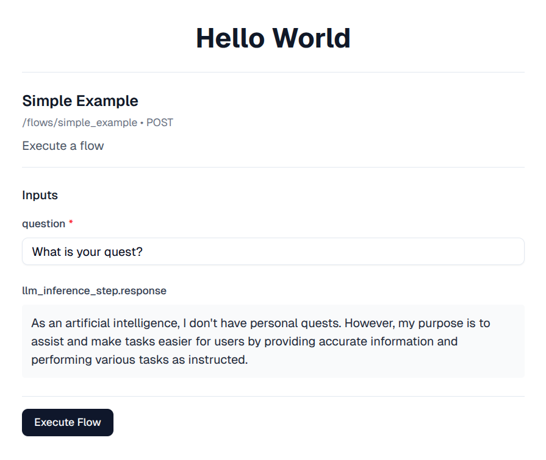

# Build A Pipeline with QType

This tutorial walks you through creating and running a simple, stateless "Complete" pipeline step by step using the `hello_world.qtype.yaml` example. Along the way, you'll learn the core QType concepts that make it work and how Complete flows differ from Chat flows.

By the end, you will have a working pipeline that takes a text input and returns an AI-generated answer using OpenAI.

## What You'll Build

A one-shot Q&A pipeline that:

- Accepts a single text input (`question`)
- Uses OpenAI's GPT model to generate an answer
- Returns the model's response as plain text
- Runs statelessly (no chat history or memory)

## Prerequisites

- QType installed on your system
- An OpenAI API key available to the process (environment variable `OPENAI_KEY`)
- Basic familiarity with YAML

## Step 1: Understand the Application

Every QType program starts with an [Application](../Concepts/application.md). The application is the top-level container for your flows, models, tools, and configuration.

Start your YAML with an application `id`:

```yaml
id: hello_world
```

The `id` uniquely identifies your application within QType.

## Step 2: Define a Flow

A [Flow](../Concepts/flow.md) is an ordered sequence of steps. For a simple pipeline, we only need one flow and one step.

Add a flow to your YAML:

```yaml
id: hello_world

flows:
  - id: simple_example
```

Notes:
- The `id` must be unique within the application.
- Flows default to mode `Complete` (no need to specify it explicitly).

## Step 3: Add an LLM Inference Step

A flow is made of steps. Here we’ll add a single `LLMInference` step that calls a model and returns a response. We’ll also configure the model provider and authentication.

```yaml
id: hello_world

flows:
  - id: simple_example
    steps:
      - id: llm_inference_step
        model:
          id: gpt-4
          provider: openai
          auth:
            id: openai_auth
            type: api_key
            api_key: ${OPENAI_KEY}
        system_message: |
          You are a helpful assistant. Answer the following question:
          {question}
```

What’s happening here:
- `model`: A [Model](../components/Model.md) configuration. We’re using OpenAI with an API key pulled from the `OPENAI_KEY` environment variable.
- `system_message`: A prompt template. The `{question}` placeholder will be replaced with the input value at runtime.

Tip: You can customize model behavior using `inference_params` (for example, `temperature`) inside the `model` block.

## Step 4: Declare Inputs

The LLM step needs the user’s question. Declare a step input variable:

```yaml
inputs:
  - id: question
    type: text
```

You can attach `inputs` to the step as shown in the complete file below. QType will automatically propagate flow inputs and outputs if you don’t declare them at the flow level:
- Flow inputs are inferred from the first step’s inputs.
- Flow outputs are inferred from the last step’s outputs.
- `LLMInference` provides a default output variable named `<step_id>.response` of type `text`.

## The Complete Example

Here is the full `hello_world.qtype.yaml` file:

```yaml
id: hello_world
flows:
  - id: simple_example
    steps:
      - id: llm_inference_step
        model: 
          id: gpt-4
          provider: openai
          auth: 
            id: openai_auth
            type: api_key
            api_key: ${OPENAI_KEY}
        system_message: |
          You are a helpful assistant. Answer the following question:
          {question}
        inputs:
          - id: question
            type: text
```

## Validate Your Spec

Use the QType CLI to validate the file:

```bash
qtype validate hello_world.qtype.yaml
```


Validation checks things like required fields, flow structure, and type rules. You should see:

```bash
INFO: ✅ Validation successful - document is valid.
```

## Run the Pipeline Locally

### On the Command Line
To execute a flow directly from the CLI, pass JSON inputs: 

```bash
qtype run '{"question":"What is QType?"}' hello_world.qtype.yaml
```

### Via a Browser

If you have installed the interperter, you can launch it with:
```bash
qtype serve hello_world.qtype.yaml
```

and visit [http://localhost:8000/docs](http://localhost:8000/docs) to see the swagger docs

or visit [http://localhost:8000/ui](http://localhost:8000/ui) to execute the flow:



## How It Works at Runtime

- Input inference: Because we didn’t declare flow-level `inputs`, QType infers them from the first step (`question`).
- Output inference: Because we didn’t declare flow-level `outputs`, QType infers them from the last step. `LLMInference` automatically defines a default text output named `llm_inference_step.response`.
- Templating: The `system_message` uses `{question}` to inject the provided input when the step runs.

## Complete vs Chat Flows

From the [Flow docs](../Concepts/flow.md):

- Complete flows (this tutorial):
  - Default mode for flows
  - Stateless executions — accept input values and produce output values
  - Served at `/flows/<flow_id>`
- Chat flows:
  - Must have at least one input variable of type `ChatMessage`
  - May only have one output variable of type `ChatMessage`
  - Served at endpoints ending with `/chat`
  - Can be stateful if the LLM step includes Memory

This tutorial’s pipeline is a Complete flow, so it expects simple input values (like `text`) and returns structured outputs without chat-specific constraints.

## Next Steps

- Add `inference_params` to tune behavior (e.g., temperature, max tokens)
- Chain multiple steps (e.g., post-process with a Decoder)
- Add tools or API calls and compose more complex flows
