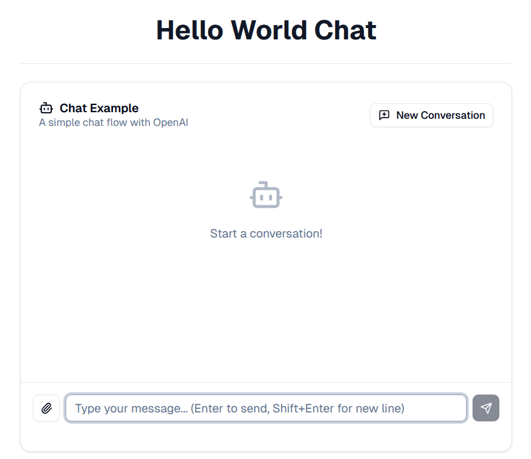

# Building A Chatbot with QType

This tutorial will walk you through creating a simple chatbot step by step, using the `hello_world_chat.qtype.yaml` example. Along the way, we'll explain the core QType concepts that make it all work.

By the end of this tutorial, you'll have a functioning chatbot that can maintain conversation history and respond intelligently using OpenAI's language models.

## What You'll Build

We're going to create a stateful chatbot that:

- Accepts user messages
- Maintains conversation history in memory
- Uses OpenAI's GPT model for responses
- Returns AI-generated responses

## Prerequisites

Before we start, make sure you have:

- QType installed on your system
- An OpenAI API key (set as the `OPENAI_KEY` environment variable)
- Basic familiarity with YAML syntax

## Step 1: Understanding the Application Structure

Every QType program starts with an [Application](../Concepts/application.md). Think of an application as the blueprint for your entire AI-powered program - it's the top-level container that holds all your models, flows, tools, and configuration.

Let's create a new file called `hello_world_chat.qtype.yaml` and start with the basic application structure:

```yaml
id: hello_world
```

The `id` field is required and gives your application a unique identifier. This will be used internally by QType to reference your application.

## Step 2: Defining Your Flow

Next, we need to define a [Flow](../Concepts/flow.md). A flow is a sequence of steps that work together to accomplish a specific task. For our chatbot, we need a flow that can handle chat interactions.

Add this to your YAML file:

```yaml
id: hello_world

flows:
  - id: simple_chat_example
    description: A simple stateful chat flow with OpenAI
    mode: Chat
```

Here's what each field means:

- `id`: A unique identifier for this flow
- `description`: Human-readable description of what this flow does
- `mode`: Set to "Chat" to indicate this flow handles conversational interactions

## Step 3: Adding Steps to Your Flow

Flows contain a series of steps. For our chatbot, we need a single step that performs LLM inference. Let's add a `steps` section:

```yaml
id: hello_world

flows:
  - id: simple_chat_example
    description: A simple stateful chat flow with OpenAI
    mode: Chat
    steps:
      - id: llm_inference_step
```

## Step 4: Configuring Memory

One key feature of a good chatbot is the ability to remember previous parts of the conversation. We'll add a [Memory](../Concepts/memory.md) component to our step:

```yaml
steps:
  - id: llm_inference_step
    memory: 
      id: chat_memory
```

This creates a memory store with the ID `chat_memory` that will keep track of the conversation history. QType will automatically manage adding user messages and AI responses to this memory.

## Step 5: Defining the Model

Next, we need to configure which AI [Model](../Concepts/model.md) our chatbot will use. Models in QType represent the configuration for connecting to AI providers like OpenAI:

```yaml
steps:
  - id: llm_inference_step
    memory: 
      id: chat_memory
    model: 
      id: gpt-4
      provider: openai
      auth: 
        id: openai_auth
        type: api_key
        api_key: ${OPENAI_KEY}
```

Breaking this down:

- `id`: A unique name for this model configuration
- `provider`: Specifies we're using OpenAI
- `auth`: Configuration for authenticating with OpenAI's API
  - `type`: We're using API key authentication
  - `api_key`: References the `OPENAI_KEY` environment variable using `${OPENAI_KEY}` syntax

Add your openai key to `.env` like:
```
OPENAI_KEY=sk...
```

## Step 6: Setting the System Message

The system message tells the AI how to behave. Let's add a helpful system prompt:

```yaml
steps:
  - id: llm_inference_step
    memory: 
      id: chat_memory
    model: 
      id: gpt-4
      provider: openai
      auth: 
        id: openai_auth
        type: api_key
        api_key: ${OPENAI_KEY}
    system_message: |
      You are a helpful assistant.
```

The `|` syntax in YAML allows us to write multi-line strings. You can customize this system message to give your chatbot a specific personality or role.

## Step 7: Defining Input and Output Variables

Finally, we need to define what data flows into and out of our step using [Variables](../Concepts/variable.md). Variables define the structure of data that moves between different parts of your application:

```yaml
steps:
  - id: llm_inference_step
    memory: 
      id: chat_memory
    model: 
      id: gpt-4
      provider: openai
      auth: 
        id: openai_auth
        type: api_key
        api_key: ${OPENAI_KEY}
    system_message: |
      You are a helpful assistant.
    inputs:
      - id: user_message
        type: ChatMessage
    outputs:
      - id: response_message
        type: ChatMessage
```

Here we're defining:

- **Input**: `user_message` of type `ChatMessage` - this will receive the user's input
- **Output**: `response_message` of type `ChatMessage` - this will contain the AI's response

The `ChatMessage` type is a built-in QType type specifically designed for chat applications.

## The Complete Chatbot

Here's the complete `hello_world_chat.qtype.yaml` file we've built:

```yaml
id: hello_world

flows:
  - id: simple_chat_example
    description: A simple stateful chat flow with OpenAI
    mode: Chat
    steps:
      - id: llm_inference_step
        memory: 
          id: chat_memory
        model: 
          id: gpt-4
          provider: openai
          auth: 
            id: openai_auth
            type: api_key
            api_key: ${OPENAI_KEY}
        system_message: |
          You are a helpful assistant.
        inputs:
          - id: user_message
            type: ChatMessage
        outputs:
          - id: response_message
            type: ChatMessage
```

## Validating Your Chatbot

Use the `qtype` cli to validate your file:

```bash
qtype validate hello_world_chat.qtype.yaml
```

You should see:
```bash
INFO: ✅ Schema validation successful.
INFO: ✅ Model validation successful.
INFO: ✅ Language validation successful
INFO: ✅ Semantic validation successful
```

If you get errors, correct them before proceeding.

## Running Your Chatbot

Finally, you can use the interpreter to serve your qtype application and interact with it:

```bash
qtype serve hello_world_chat.qtype.yaml
```

This will start a web server on your local machine

Visit:

* [http://localhost:8000/ui](http://localhost:8000/ui) to see a web UI where you can use your prototype.
* [http://localhost:8000/docs](http://localhost:8000/docs) to see swagger docs for the automatically generated API.



## Understanding What Happens at Runtime

When you run this chatbot:

1. **User Input**: A user sends a message, which becomes the `user_message` input
2. **Memory Integration**: The message is added to the `chat_memory` along with previous conversation history
3. **LLM Inference**: The step sends the conversation history and system message to OpenAI's GPT model
4. **Response Generation**: The model generates a response based on the conversation context
5. **Memory Update**: The AI's response is added to the memory for future turns
6. **Output**: The response is returned as `response_message`

## Next Steps

Now that you have a basic chatbot, you might want to:

- Experiment with different system messages to change your bot's personality
- Try different OpenAI models (like `gpt-4` or `gpt-3.5-turbo`)
- Add [Tools](../Concepts/tool.md) to give your chatbot additional capabilities
- Explore other [Step types](../Concepts/Steps/index.md) to create more complex workflows
