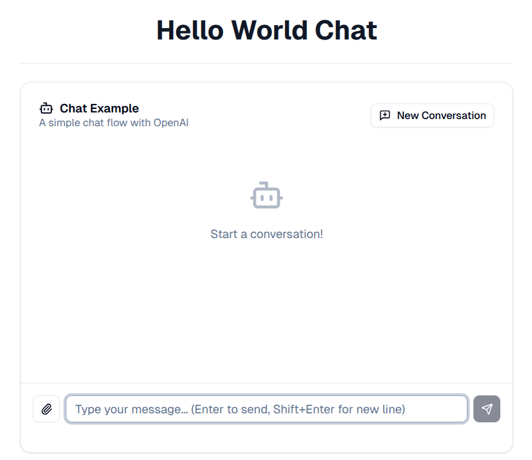

# Build A Chatbot with QType

This tutorial will walk you through creating a simple chatbot step by step, using the `hello_world_chat.qtype.yaml` example. Along the way, we'll explain the core QType concepts that make it all work.

By the end of this tutorial, you'll have a functioning chatbot that can maintain conversation history and respond intelligently using OpenAI's language models.

## What You'll Build

We're going to create a stateful chatbot that:

- Accepts user messages
- Maintains conversation history in memory
- Uses OpenAI's GPT model for responses
- Returns AI-generated responses

## Prerequisites

Before we start, make sure you have:

- QType installed on your system
- An OpenAI API key (set as the `OPENAI_KEY` environment variable)
- Basic familiarity with YAML syntax

## Step 1: Understanding the Application Structure

Every QType program starts with an [Application](../Concepts/Core/application.md). Think of an application as the blueprint for your entire AI-powered program - it's the top-level container that holds all your models, flows, tools, and configuration.

Let's create a new file called `hello_world_chat.qtype.yaml` and start with the basic application structure:

```yaml
id: hello_world
```

The `id` field is required and gives your application a unique identifier. This will be used internally by QType to reference your application.

## Step 2: Defining Your Model

Before creating a flow, we need to define the AI [Model](../Concepts/Core/model.md) our chatbot will use. Models in QType represent the configuration for connecting to AI providers like OpenAI.

Add this to your YAML file:

```yaml
id: hello_world

models:
  - type: Model
    id: gpt-4
    provider: openai
    model_id: gpt-4-turbo
    inference_params:
      temperature: 0.7
```

Breaking this down:

- `type`: Always set to "Model" for standard language models (this is a discriminator field)
- `id`: A unique name for this model configuration
- `provider`: Specifies we're using OpenAI
- `model_id`: The specific OpenAI model to use
- `inference_params`: Optional parameters like temperature

**Note**: For authentication, you'll need to set the `OPENAI_API_KEY` environment variable. QType will automatically use it for OpenAI providers.

## Step 3: Defining Memory

A good chatbot remembers previous conversation turns. Let's add a [Memory](../Concepts/Core/memory.md) configuration:

```yaml
id: hello_world

models:
  - type: Model
    id: gpt-4
    provider: openai
    model_id: gpt-4-turbo

memories:
  - id: chat_memory
    token_limit: 50000
    chat_history_token_ratio: 0.7
```

This creates a memory store that will keep track of conversation history. The `token_limit` and `chat_history_token_ratio` control how much conversation history is retained.

## Step 4: Defining Your Flow

Next, we need to define a [Flow](../Concepts/Core/flow.md). A flow is a sequence of steps that work together to accomplish a specific task. For our chatbot, we need a conversational flow.

Add this to your YAML file:

```yaml
flows:
  - type: Flow
    id: simple_chat_example
    description: A simple stateful chat flow with OpenAI
    interface:
      type: Conversational
```

Here's what each field means:

- `type`: Always set to "Flow" (discriminator field)
- `id`: A unique identifier for this flow
- `description`: Human-readable description of what this flow does
- `interface.type`: Set to "Conversational" to indicate this flow handles chat interactions

## Step 5: Declaring Variables

All data flowing through a flow must be declared as [Variables](../Concepts/Core/variable.md). For our chatbot, we need variables for the user's message and the AI's response:

```yaml
flows:
  - type: Flow
    id: simple_chat_example
    description: A simple stateful chat flow with OpenAI
    interface:
      type: Conversational
    variables:
      - id: user_message
        type: ChatMessage
      - id: response_message
        type: ChatMessage
    inputs:
      - user_message
    outputs:
      - response_message
```

The key principle here is **explicit variable declaration**:

- `variables`: Lists all variables used in the flow
- `inputs`: Specifies which variables are inputs (by referencing their IDs)
- `outputs`: Specifies which variables are outputs (by referencing their IDs)
- `ChatMessage` is a [Domain Type](../How-To%20Guides/Data%20Types/domain-types.md) specifically for chat applications

## Step 6: Adding Steps to Your Flow

Now we add the LLM inference step that will generate responses:

```yaml
flows:
  - type: Flow
    id: simple_chat_example
    description: A simple stateful chat flow with OpenAI
    interface:
      type: Conversational
    variables:
      - id: user_message
        type: ChatMessage
      - id: response_message
        type: ChatMessage
    inputs:
      - user_message
    outputs:
      - response_message
    steps:
      - type: LLMInference
        id: llm_inference_step
        model: gpt-4
        memory: chat_memory
        system_message: "You are a helpful assistant."
        inputs:
          - user_message
        outputs:
          - response_message
```

Breaking down the step configuration:

- `type`: Set to "LLMInference" (discriminator field)
- `id`: Unique identifier for this step
- `model`: References the model by ID ("gpt-4")
- `memory`: References the memory by ID ("chat_memory")
- `system_message`: Sets the AI's behavior
- `inputs`/`outputs`: Reference the variables by ID

## The Complete Chatbot

Here's the complete `hello_world_chat.qtype.yaml` file we've built:

```yaml
id: hello_world

models:
  - type: Model
    id: gpt-4
    provider: openai
    model_id: gpt-4-turbo
    inference_params:
      temperature: 0.7

memories:
  - id: chat_memory
    token_limit: 50000
    chat_history_token_ratio: 0.7

flows:
  - type: Flow
    id: simple_chat_example
    description: A simple stateful chat flow with OpenAI
    interface:
      type: Conversational
    variables:
      - id: user_message
        type: ChatMessage
      - id: response_message
        type: ChatMessage
    inputs:
      - user_message
    outputs:
      - response_message
    steps:
      - type: LLMInference
        id: llm_inference_step
        model: gpt-4
        memory: chat_memory
        system_message: "You are a helpful assistant."
        inputs:
          - user_message
        outputs:
          - response_message
```

## Key Concepts Demonstrated

This example demonstrates the core principles of the new QType DSL:

1. **Type Discriminators**: Every component has a `type` field (Model, Flow, LLMInference)
2. **Centralized Definitions**: Models and memories are defined once at the application level
3. **Reference by ID**: Steps reference models and memories by their string IDs
4. **Explicit Variable Declaration**: All variables are declared in the `variables` section
5. **Flow Interface**: The `interface` field specifies how the flow is hosted (Conversational)

## Validating Your Chatbot

Use the `qtype` cli to validate your file:

```bash
qtype validate hello_world_chat.qtype.yaml
```

You should see:
```bash
INFO: ✅ Validation successful - document is valid.
```

If you get errors, correct them before proceeding.

## Running Your Chatbot

Finally, you can use the interpreter to serve your qtype application and interact with it:

```bash
qtype serve hello_world_chat.qtype.yaml
```

This will start a web server on your local machine

Visit:

* [http://localhost:8000/ui](http://localhost:8000/ui) to see a web UI where you can use your prototype.
* [http://localhost:8000/docs](http://localhost:8000/docs) to see swagger docs for the automatically generated API.



## Understanding What Happens at Runtime

When you run this chatbot:

1. **User Input**: A user sends a message, which becomes the `user_message` input
2. **Memory Integration**: The message is added to the `chat_memory` along with previous conversation history
3. **LLM Inference**: The step sends the conversation history and system message to OpenAI's GPT model
4. **Response Generation**: The model generates a response based on the conversation context
5. **Memory Update**: The AI's response is added to the memory for future turns
6. **Output**: The response is returned as `response_message`

## Next Steps

Now that you have a basic chatbot, you might want to:

- Experiment with different system messages to change your bot's personality
- Try different OpenAI models (like `gpt-4` or `gpt-3.5-turbo`)
- Add [Tools](../Concepts/Core/tool.md) to give your chatbot additional capabilities
- Explore other [Step types](../Concepts/Steps/index.md) to create more complex workflows
